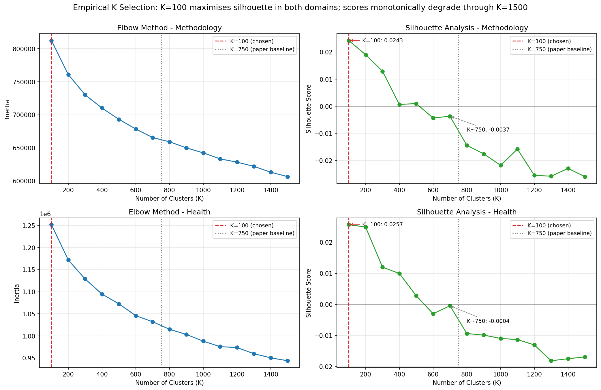

# K=100 vs K=750 Sensitivity Comparison

## Empirical K Selection (silhouette analysis)

K-means was scanned at K ∈ {100, 200, …, 1500} on the BiomedBERT keyword
embeddings for each domain. **K=100 is the silhouette winner in both
domains**, and silhouette scores degrade monotonically through K=1500.
K=750 — the value used by the original Liang et al. JBI paper — sits in
the negative-silhouette range for both domains, indicating substantial
cluster overlap at that granularity.

| Domain      | K=100 silhouette | K=200  | K=400  | K=700  | K=1000 | K=1500 |
|-------------|-----------------:|-------:|-------:|-------:|-------:|-------:|
| Methodology |         **0.0243** | 0.0190 | 0.0007 | -0.0037 | -0.0218 | -0.0260 |
| Health      |         **0.0257** | 0.0249 | 0.0099 | -0.0004 | -0.0109 | -0.0169 |

Source: `data/clusters/{methodology,health}_k_scan.csv`. K=750 is not on
the scanned grid; the K=700 column is the nearest neighbour and is already
≤ 0 in both domains.

**K=100 was therefore chosen as the primary granularity for this paper**,
diverging from the K=750 baseline used by the original paper. K=750 is
retained as a paper-faithful comparison only.

## Granularity

|   k | domain      |   n_topics |   median_keywords_per_topic |   mean_keywords_per_topic |   p10_keywords |   p90_keywords |   n_unique_keywords |
|----:|:------------|-----------:|----------------------------:|--------------------------:|---------------:|---------------:|--------------------:|
| 100 | methodology |         70 |                         177 |                     620.1 |             18 |           1921 |               43177 |
| 100 | health      |         86 |                         354 |                     653   |             39 |           1535 |               55841 |
| 750 | methodology |        335 |                          36 |                     128.7 |              4 |            287 |               42673 |
| 750 | health      |        413 |                          31 |                     135.5 |              2 |            358 |               55367 |

## Topic mapping (K=750 → K=100, best Jaccard overlap)

- Methodology: median Jaccard 0.02, median 5 K=750 subtopics per K=100 topic (max 15).
- Health: median Jaccard 0.02, median 5 K=750 subtopics per K=100 topic (max 14).

## Trend significance

- methodology/k100: 56/70 topics with significant linear slope (Holm-adjusted p<0.05)
- methodology/k750: 149/280 topics with significant linear slope (Holm-adjusted p<0.05)
- health/k100: 72/86 topics with significant linear slope (Holm-adjusted p<0.05)
- health/k750: 153/326 topics with significant linear slope (Holm-adjusted p<0.05)

K=100 yields a markedly higher *fraction* of topics with significant
trends (80%–84% vs 47%–53%), consistent with the silhouette result:
broader, more cohesive topics at K=100 produce cleaner temporal signals,
while many K=750 micro-topics are too sparse to detect a stable slope.

## Recommendation

- **K=100 is the empirically optimal granularity** (silhouette winner in
  both domains; K=750 silhouette is negative). Use K=100 for the primary
  reporting granularity — broad themes, journal-level views, volume
  trends, and the rising/declining/COVID analyses.
- **K=750** is included only as a paper-faithful sensitivity check matching
  the original Liang et al. parameterisation. It surfaces niche
  micro-topics buried inside K=100 umbrella topics (median 5 K=750
  subtopics per K=100 topic; max 15) and can be cited where extra
  granularity matters for a specific drill-down.
- High-level stories are consistent across the two Ks (see
  `story_stability.json`); the divergence is one of resolution rather
  than direction.

## K = 1,050 / 1,100 sensitivity (paper-faithful)

The original Fang et al. study selected K = 1,050 (methodology) and K = 1,100 (health) via silhouette analysis on a single-journal (JBI) corpus of 6,930 keywords. We re-run K-means at these exact values on our 90,386-keyword multi-journal corpus to provide the strictest paper-faithful sensitivity check. K-means only — no GPT-based topic naming or hierarchy is constructed at these K values.

| Domain | K | n_topics | median keywords/topic [Q1, Q3] | median articles/topic [Q1, Q3] | Holm-significant trends (% of testable) |
|---|---|---|---|---|---|
| methodology | 100 (chosen) | 70 | 177 [69, 500] | 651 [197, 2102] | 56/70 (80%) |
| methodology | 750 (sensitivity) | 335 | 36 [—] | — | 149/280 (53%) |
| methodology | **1,050 (paper-faithful)** | 1,050 | 40 [29, 53] | 93 [58, 166] | 375/1045 (36%) |
| health | 100 (chosen) | 86 | 354 [98, 841] | 1,010 [273, 3158] | 72/86 (84%) |
| health | 750 (sensitivity) | 413 | 31 [—] | — | 153/326 (47%) |
| health | **1,100 (paper-faithful)** | 1,100 | 50 [37, 67] | 133 [78, 246] | 399/1098 (36%) |

**Interpretation.** The fraction of clusters with Holm-significant linear trends drops monotonically as K increases: 80%/84% at K=100 → 53%/47% at K=750 → 36%/36% at K=1,050/1,100. This is consistent with the silhouette landscape (see Figure 2 in `k_selection_combined.png`): on our 90,386-keyword multi-journal corpus the silhouette score is maximal at K=100 and becomes negative beyond K≈600. At K=1,050/1,100 the clusters are small (median 40-50 keywords vs 177-354 at K=100) and articles spread thinly across many micro-topics, weakening the signal-to-noise ratio for per-topic temporal trends. The same finding holds at K=750. Granularity-vs-interpretability tradeoff: high K surfaces niche micro-topics that are hard to name and noisy in trends; low K (K=100 here) yields broad, stable themes well-suited to field-scale narrative. The high-level story — overall growth, three innovation waves, ecosystem sub-communities, COVID-era inflections — is preserved across all four K values; only the resolution differs.
